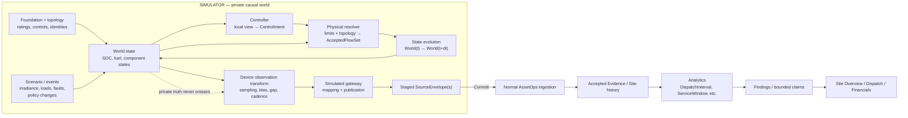
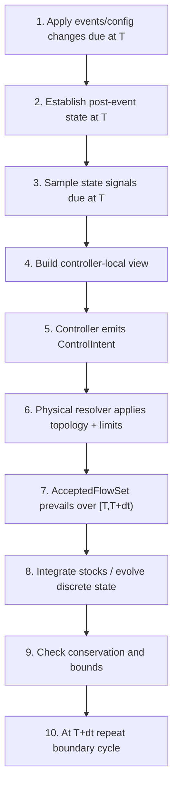
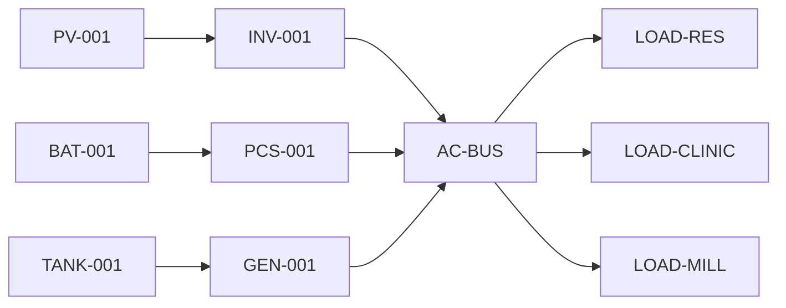
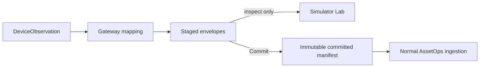
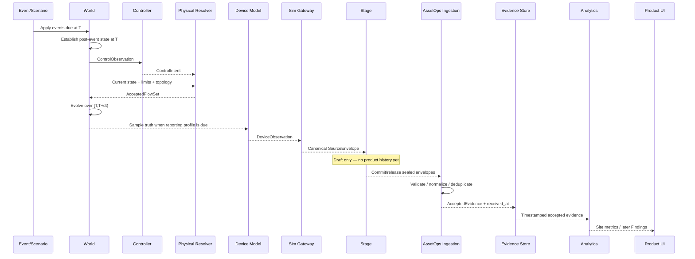
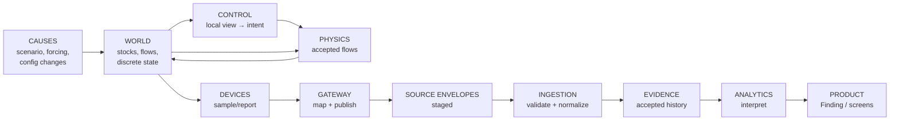

# AssetOps Mini-Grid Technical Walkthrough
## From simulated world to gateway envelopes, ingestion and product evidence

**Architecture basis:** `simulator_design_v4.md`  
**Implementation-plan basis:** current T024–T029 sequence, especially T024, T025, T026 and T027.

This document explains the technical model at the level needed to follow implementation closely without depending on particular source files, class names or framework choices.

The central idea is:

> **The simulator owns a private physical world. Devices observe that world. A simulated gateway publishes only device/source records. AssetOps ingests those records exactly as it would from a real site.**

Everything else follows from that separation.

---

# 1. The whole system in one picture



There are three fundamentally different kinds of information:

1. **World truth** — what physically happened in the simulation.
2. **Reported evidence** — what simulated devices/gateway say happened.
3. **Product interpretation** — what AssetOps can conclude from accepted evidence.

These must never collapse into one object.

---

# 2. Concrete mini-grid used throughout

Use one understandable site:

```text
Kobo Mini-grid

PV-001 / INV-001
        |
        v
      AC-BUS <---- GEN-001 <---- TANK-001
        ^
        |
BAT-001 / PCS-001

AC-BUS ---> LOAD-RES
       ---> LOAD-CLINIC
       ---> LOAD-MILL
```

## 2.1 Components

| Component | Important properties | Important dynamic state |
|---|---|---|
| PV-001 | rated 60 kWp | available PV power |
| INV-001 | 50 kW inverter limit | accepted PV output |
| BAT-001 | 120 kWh nominal, 30% reserve | stored energy / SOC |
| PCS-001 | ±22 kW | accepted charge/discharge power |
| GEN-001 | 40 kW rating, min runtime 10 min | STOPPED/STARTING/RUNNING/FAILED |
| TANK-001 | 500 L | fuel volume |
| LOAD-RES | residential profile | demand / served demand |
| LOAD-CLINIC | critical | demand / served demand |
| LOAD-MILL | productive | demand / served demand |

## 2.2 Site controls

Examples:

```text
source_priority:
    PV
    BATTERY
    GENERATOR

critical_load_priority:
    LOAD-CLINIC
    LOAD-RES
    LOAD-MILL

battery.minimum_reserve_soc = 30%

generator.start_soc_threshold = 27%
generator.minimum_runtime = 10 min
```

The controls are **configuration**, not telemetry.

A scenario may change them at a particular instant.

---

# 3. The minimum conceptual data model

The exact implementation language or class layout may change. The concepts below should not.

## 3.1 Component

```text
Component
    component_id
    component_type
    static properties / ratings
    ports / topology roles
```

Example:

```text
Component
    id: PCS-001
    type: battery_converter
    properties:
        max_charge_power: 22 kW
        max_discharge_power: 22 kW
        efficiency: 0.95
```

A Component answers:

> **What physical thing exists and what are its capabilities?**

## 3.2 StateRef

A semantic state name is not enough because several components may expose the same type of state.

```text
StateRef
    scope
    component_id
    state_key
```

Examples:

```text
(COMPONENT, BAT-001, soc)
(COMPONENT, LOAD-RES, demand)
(COMPONENT, LOAD-MILL, demand)
(SITE, null, unserved_load)
```

A `StateRef` answers:

> **Whose state is this?**

## 3.3 WorldState

This is private simulator truth at one simulation instant.

```text
WorldState
    simulation_time

    stocks
        BAT-001 stored_energy = 72 kWh
        TANK-001 fuel_volume = 312 L

    flows
        pv_to_load = 25 kW
        battery_to_load = 8 kW
        generator_to_load = 0 kW

    discrete
        GEN-001 = STOPPED
```

Three categories matter:

### Stocks

Persist and accumulate.

```text
battery stored energy
fuel volume
accumulated stress
```

### Flows

Apply during a time interval.

```text
PV power
battery power
fuel-consumption rate
served load
```

### Discrete state

State machines.

```text
generator = RUNNING
charger = AVAILABLE
door = AJAR
```

## 3.4 ControlObservation

This is **what the site controller is allowed to know**, not necessarily what AssetOps can see.

Example:

```text
ControlObservation at 14:20

load_demand              34 kW
PV_available             27 kW
battery_SOC              64%
battery_discharge_limit  22 kW
generator_state          RUNNING
effective reserve        30%
```

This distinction is critical.

The site's EMS may have a fast local BMS value every second while AssetOps only receives a BMS report every five minutes.

Controller operation must not depend on the reporting cadence of the simulated gateway.

## 3.5 ControlIntent

The controller does not directly change physics.

It asks for something.

```text
ControlIntent

generator_request       STOP
battery_power_request   +12 kW discharge
PV_limit_request        50 kW
```

This answers:

> **What did the controller want the equipment to do?**

## 3.6 AcceptedFlowSet

The physical resolver determines what can actually happen.

```text
AcceptedFlowSet

pv_to_load          27 kW
battery_to_load      7 kW
generator_to_load    0 kW
unserved_load        0 kW
```

Example:

```text
controller requests battery discharge = 30 kW
PCS physical limit                  = 22 kW

Accepted battery discharge          = 22 kW
```

The request remains in the control trace.

Only the accepted 22 kW changes the world.

## 3.7 DeviceObservation

This is a simulated device report generated from world state.

```text
DeviceObservation

device_id       BMS-001
signal_id       soc
source_time     14:25
value           61.7
unit            %
quality         GOOD
```

This is still inside the simulator/gateway side.

It is **not yet AssetOps Evidence**.

## 3.8 SourceEnvelope

The simulated gateway maps observations into the canonical public source contract.

```text
SourceEnvelope

site_id
source/gateway_id
device_id
signal_id
mapping_id + mapping_version

value
unit
quality

source_time
gateway_time / published_at

message_id / sequence_id
source_mode = SIMULATED
```

This is the crucial boundary object.

> **SourceEnvelope is the only simulator-produced data structure allowed to cross into normal AssetOps ingestion.**

No `WorldState`, `ControlIntent`, `AcceptedFlowSet`, private cause or scenario expectation is permitted inside it.

## 3.9 Accepted evidence

After Commit, the normal ingestion path validates and normalizes the envelope.

Conceptually:

```text
AcceptedEvidence

site
signal
normalized value/unit
source identity
quality
source_time
published_at
received_at
mapping/configuration basis
provenance
```

Only after this point may product analytics use the record.

---

# 4. One simulation boundary in detail

Suppose the fixed time step is five minutes.

We are at:

```text
T = 14:20
dt = 5 min
```

The canonical boundary cycle is:



The device/gateway publication machinery runs when each reporting profile says a signal is due.

---

# 5. Step 1 — events and configuration changes at T

Assume a policy change becomes effective at exactly 14:20:

```text
battery.minimum_reserve_soc
25% -> 30%
```

Before 14:20, the old policy governed operation.

At 14:20:

```text
Event:
    kind: POLICY_CHANGE
    target: BAT-001.minimum_reserve_soc
    effective_time: 14:20
    new_value: 30%
```

The boundary rule is:

> **Apply events due at T before exposing state at T.**

This avoids ambiguous statements such as:

```text
SOC at 14:20 was observed under which configuration?
```

The answer is now deterministic:

```text
State/configuration at 14:20 = post-event configuration.
```

---

# 6. Step 2 — post-event state at T

Immediately after the policy change:

```text
WorldState @ 14:20

BAT-001 SOC          64%
GEN-001 state        RUNNING
PV available         27 kW

Effective reserve    30%
```

Notice something important:

The policy changed, but the battery SOC did not magically change.

Configuration and world state are different things.

---

# 7. Step 3 — observations at T

There are two related but different measurement semantics.

## 7.1 Instantaneous / state measurement

A reading at 14:20 may mean:

```text
battery SOC at 14:20 = 64%
generator state at 14:20 = RUNNING
```

These use post-event state.

## 7.2 Interval measurement

A power/energy reading ending at 14:20 may mean:

```text
average generator power over [14:15,14:20)
energy delivered over [14:15,14:20)
```

So one timestamp can legitimately contain:

```text
SOC @ 14:20                       post-event state
generator average power @ 14:20  preceding interval
```

That is intentional.

---

# 8. Step 4 — controller local view

Now the controller sees the world under the newly effective policy.

Example:

```text
ControlObservation @ 14:20

total demand                 34 kW

PV available                 27 kW

battery SOC                  64%
battery reserve              30%
battery discharge capability 22 kW

generator state              RUNNING
generator minimum-runtime
constraint                   already satisfied
```

The controller may also know per-load priority:

```text
LOAD-CLINIC  critical
LOAD-RES     normal
LOAD-MILL    productive/deferrable
```

Again:

> The controller-local view is not a public telemetry bundle.

It is an internal input to the simulated EMS/controller.

---

# 9. Step 5 — controller emits intent

A deliberately simple controller could decide:

```text
remaining demand after PV = 7 kW

battery can provide 7 kW
battery remains above reserve

therefore:
    battery request = discharge 7 kW
    generator request = STOP
```

Represented conceptually:

```text
ControlIntent @ 14:20

BAT-001 / PCS-001
    requested_power = +7 kW discharge

GEN-001
    requested_state = STOP
```

For a prolonged-runtime scenario the policy may instead produce:

```text
GEN-001 requested_state = RUNNING
```

even when PV+BESS appear sufficient.

That scenario authors the **cause**.

It does not author:

```text
candidate_avoidable = true
```

AssetOps must discover that later.

---

# 10. Step 6 — physical resolver

The physical resolver answers:

> Given the controller's request, the actual component limits, topology and current world state, what can physically happen?

A useful conceptual interface is:

```text
resolve(
    world_state,
    topology,
    component_properties,
    forcing,
    control_intent
)
    -> AcceptedFlowSet
```

## 10.1 Example: healthy interval

Inputs:

```text
Demand                      34 kW
PV available                27 kW
PCS discharge limit         22 kW
SOC                         64%
reserve                     30%

ControlIntent:
    battery discharge        7 kW
    generator STOP
```

Accepted result:

```text
pv_to_load                  27 kW
battery_to_load              7 kW

generator_to_load            0 kW
unserved_load                0 kW
curtailed_pv                 0 kW
```

Conservation:

```text
sources = sinks

27 PV + 7 battery
=
34 served load
```

## 10.2 Example: controller asks for impossible battery power

```text
ControlIntent:
battery discharge = 30 kW

PCS limit = 22 kW
```

The resolver does not rewrite history to pretend that 30 kW happened.

It records:

```text
requested = 30 kW
accepted  = 22 kW
```

If demand remains:

```text
residual demand = 8 kW
```

then policy/topology may allocate generator power or mark unserved load.

---

# 11. Topology is part of the resolver

The resolver should not treat the site as an undifferentiated bucket of power.

It knows permitted relationships:



The topology does **not** mean the simulator needs AC power-flow equations.

For this demo it means:

```text
which components exist
which flows are permitted
which component owns each state
which limits apply
```

---

# 12. Step 7 — accepted flows evolve the world

Assume:

```text
battery discharge = 7 kW
dt = 5 min
battery discharge efficiency = 95%
```

The physical flow over the interval is accepted.

Conceptually:

```text
energy delivered from battery
= 7 kW × 5/60 h
= 0.583 kWh
```

The internal stored-energy reduction accounts for efficiency according to the declared model.

Likewise:

```text
generator accepted power
-> generator energy
-> fuel consumption rate/model
-> tank-volume reduction
```

The key rule is:

> **Stocks evolve from AcceptedFlowSet, never directly from ControlIntent.**

---

# 13. State transition from T to T+dt

At 14:25 the new world might be:

```text
WorldState @ 14:25

battery SOC        63.4%
generator          STOPPED
tank volume        unchanged
```

In another scenario:

```text
generator          RUNNING
generator power    12 kW
fuel volume        lower
```

This is the private causal truth.

---

# 14. Device observation is a separate transformation

Now imagine the BMS reports SOC every five minutes.

The world truth may be:

```text
BAT-001 true SOC = 63.42%
```

The observation profile might declare:

```text
device: BMS-001
signal: soc
cadence: 5 min
quantization: 0.1%
bias: +0.2%
```

The generated report could therefore be:

```text
reported SOC = 63.6%
```

AssetOps receives 63.6%.

It never receives the true 63.42%.

## 14.1 Reporting gap example

Suppose the BMS is configured to miss the 14:30 sample.

Truth still evolves:

```text
14:25 true SOC 63.4%
14:30 true SOC 62.8%
14:35 true SOC 62.2%
```

But observations may be:

```text
14:25 BMS reading 63.6%
14:30 no reading
14:35 BMS reading 62.4%
```

The physical world does not pause because the sensor missed a report.

This distinction is essential to later AssetOps statements such as:

```text
coverage = 94%
```

or:

```text
classification = Indeterminate
because battery capability evidence is incomplete.
```

---

# 15. Reporting profiles

A useful conceptual object is:

```text
ObservationBinding

StateRef
device_id
signal_id

sampling cadence
unit
quantization
bias/noise
dropout rules
quality semantics
```

Example:

```text
ObservationBinding

source:
    StateRef(COMPONENT, BAT-001, soc)

device:
    BMS-001

signal:
    soc

cadence:
    5 min

unit:
    %

reporting:
    quantize 0.1%
    one declared gap at 14:30
```

This binding answers:

> **How does a piece of physical truth become a device report?**

---

# 16. The gateway begins where the device observation ends

The gateway should not know how SOC physics works.

It receives something like:

```text
DeviceObservation

device     BMS-001
signal     soc
time       14:25
value      63.6
unit       %
quality    GOOD
```

Its job is to map and publish.

---

# 17. Gateway mapping

A gateway mapping says:

```text
BMS-001 / soc
        ->
canonical signal: battery.soc
site: kobo-001
component: BAT-001
mapping version: bms-map-v3
```

The gateway transforms:

```text
DeviceObservation
```

into:

```text
SourceEnvelope
```

not into an AssetOps Finding.

---

# 18. Canonical SourceEnvelope

An illustrative envelope:

```text
SourceEnvelope

schema_version: 1

site_id: kobo-001

gateway_id: GW-001

device_id: BMS-001
component_id: BAT-001
signal_id: battery.soc

mapping_id: bms-map
mapping_version: 3

value: 63.6
unit: %

quality: GOOD

source_time:    14:25:00
published_at:   14:25:03

message_id: ...
sequence_id: ...

source_mode: SIMULATED
```

Not present:

```text
true_SOC
scenario_cause
private event id
ControlIntent
AcceptedFlowSet
candidate_avoidable
```

That absence is as important as the fields that are present.

---

# 19. Staging versus Commit

The gateway initially writes envelopes into a **stage**.



Before Commit:

```text
Simulator Lab can inspect:
    exact envelope
    timestamps
    quality
    mapping

Operator Site history:
    unchanged
```

This gives developers a clean place to inspect the synthetic source without accidentally making draft simulator output product evidence.

---

# 20. Commit is not ingestion

Commit performs a boundary operation:

```text
stage
    ->
seal immutable envelope set
    ->
create committed manifest
    ->
release to normal ingestion
```

Commit should **not** directly write:

```text
Evidence
Site Overview
DispatchInterval
Finding
```

Those belong downstream.

---

# 21. Ingestion

Ingestion answers a different question:

> **Is this external/source record acceptable product evidence, and if so, how is it normalized and stored?**

Conceptually:

```text
ingest(SourceEnvelope)
    ->
schema validation
    ->
identity + mapping resolution
    ->
unit normalization
    ->
quality/missingness handling
    ->
deduplication / conflict handling
    ->
assign received_at
    ->
AcceptedEvidence
```

## 21.1 Three timestamps

The full path intentionally preserves:

```text
source_time
published_at
received_at
```

Example:

```text
source_time   = 14:25:00
published_at  = 14:25:03
received_at   = 14:25:05
```

With delayed publication:

```text
source_time   = 14:25:00
published_at  = 14:28:10
received_at   = 14:28:12
```

These timestamps describe different facts and should never be collapsed.

---

# 22. Accepted evidence becomes Site history

After normal ingestion:

```text
AcceptedEvidence

kobo-001
BAT-001
battery.soc
63.6 %

source_time   14:25
published_at  14:25:03
received_at   14:25:05

quality       GOOD
mapping       bms-map-v3
source_mode   SIMULATED
```

The Site Overview can now read accepted Site history exactly as it would for a live Site.

At this point the simulator could be turned off.

The product history still exists.

That is the architectural proof targeted by T027.

---

# 23. Full end-to-end sequence



---

# 24. One record followed through the entire pipeline

Consider battery SOC.

## Stage A — private world

```text
StateRef:
    BAT-001.soc

true value:
    63.42%
```

## Stage B — device model

```text
BMS profile:
    +0.2% bias
    0.1% quantization

DeviceObservation:
    63.6%
```

## Stage C — gateway

```text
SourceEnvelope:
    site       kobo-001
    component  BAT-001
    signal     battery.soc
    value      63.6 %
    source     14:25
    publish    14:25:03
```

## Stage D — ingestion

```text
AcceptedEvidence:
    normalized value 0.636 or 63.6%, according to canonical product representation
    mapping bms-map-v3
    received_at 14:25:05
```

## Stage E — analytic

Later:

```text
DispatchInterval
    battery SOC at interval
    battery capability evidence
    coverage
```

## Stage F — Finding

```text
Candidate Avoidable
```

only if accepted evidence supports the classification.

The original 63.42% private truth never participates.

---

# 25. The prolonged-generator example end to end

This example ties the architecture to the first important product Finding.

## 25.1 Scenario/world

At 14:00:

```text
generator legitimately running
battery recovering
PV rising
```

By 14:20:

```text
load                         34 kW
PV capability                27 kW
battery discharge capability 22 kW
battery SOC                  64%
```

But the configured stop policy continues to request:

```text
GEN-001 = RUNNING
```

## 25.2 Controller

```text
ControlObservation
    demand             34
    PV available       27
    SOC                64%
    reserve            30%
    generator          RUNNING
    min runtime        satisfied

ControlIntent
    generator          RUNNING
    battery discharge  0 or policy-dependent
```

## 25.3 Resolver

The resolver accepts the generator request because the machine is available.

Example:

```text
pv_to_load          22 kW
generator_to_load   12 kW
battery_to_load      0 kW

served              34 kW
unserved             0 kW
```

There is nothing physically impossible about this.

The simulator therefore does **not** label it wrong.

## 25.4 Device reports

AssetOps receives evidence such as:

```text
load meter          ~34 kW
PV capability       ~27 kW
BMS SOC             ~64%
BMS discharge limit ~22 kW
generator state     RUNNING
generator power     ~12 kW
policy              effective stop/reserve configuration
```

with one reporting gap and perhaps one delayed message.

## 25.5 Gateway

These become separate canonical source envelopes.

No envelope says:

```text
avoidable generator runtime
```

## 25.6 Ingestion

The records become accepted history.

Coverage records the gap.

## 25.7 Analytics — later T028

Only now does AssetOps reconstruct:

```text
DispatchInterval
```

and ask:

```text
Was generator operation required by:
    demand?
    PV capability?
    battery capability?
    reserve?
    generator constraints?
    time-valid policy?
    observed operator command?
```

Possible output:

```text
Candidate Avoidable
duration: 2.6–3.1 h
coverage: 94%

claim limit:
battery capability missing for 11 min
no operator-commanded override observed
```

That product conclusion is independent of the simulator's private knowledge of why the scenario was authored.

---

# 26. What should be concrete in implementation review

When following implementation, inspect these boundaries rather than individual coding style.

## Simulator world

You should be able to answer:

```text
What are the components?
What are their static properties?
What dynamic state belongs to each?
What causes change?
What is stock versus flow?
What event is due at this instant?
```

## Controller

```text
What exactly can the controller see?
What policy values are effective?
What ControlIntent did it issue?
Can it mutate the world directly?  -> it should not.
```

## Resolver

```text
What physical limits were applied?
What topology constrained the flows?
What was requested?
What was accepted?
Does source/sink balance hold?
```

## State evolution

```text
Which AcceptedFlow caused each stock change?
What interval did it apply over?
Which boundary owns the resulting state?
```

## Device layer

```text
What StateRef is being sampled?
At what cadence?
What reporting transformation occurred?
Was the sample absent, stale, delayed or biased?
```

## Gateway

```text
Which observation mapping produced this envelope?
Can I inspect the exact public payload?
Does it contain any private truth?
Are source and publication time distinct?
```

## Ingestion

```text
Was the envelope accepted or rejected?
Which mapping/configuration version was used?
What normalized evidence was created?
When was received_at assigned?
Can the Site be rebuilt without the simulator?
```

---

# 27. The most important invariants to watch in code review

These are more useful than checking whether implementation follows one preferred class diagram.

### Invariant 1 — causes do not equal conclusions

```text
Scenario:
generator stop policy causes prolonged operation

NOT:
scenario says "avoidable runtime"
```

### Invariant 2 — controller does not own physics

```text
ControlIntent != AcceptedFlowSet
```

### Invariant 3 — reports do not equal truth

```text
DeviceObservation != WorldState
```

### Invariant 4 — gateway does not interpret

```text
gateway maps/publishes observations
gateway does not generate Findings
```

### Invariant 5 — stage is not product evidence

```text
staged SourceEnvelope != accepted Site history
```

### Invariant 6 — Commit does not derive

```text
Commit releases envelopes
normal ingestion creates accepted evidence
```

### Invariant 7 — product cannot reach private truth

```text
Analytics input = accepted evidence + product configuration
NOT WorldState / AcceptedFlowSet / private scenario cause
```

### Invariant 8 — missing evidence remains missing

```text
no sample
!=
assumed previous value
!=
private simulator value
```

---

# 28. Relationship to current implementation tasks

```text
T024
    builds the electrical world:
    PV + BESS + addressed loads
    controller
    ControlIntent
    resolver
    AcceptedFlowSet

T025
    adds generator state/policy and the complete mini-grid behavior

T026
    makes the dispatch-relevant device/gateway evidence concrete:
    PV / BMS / generator / meter / policy
    one gap
    one delayed publication

T027
    crosses the protected boundary:
    staged envelopes
    -> Commit
    -> normal ingestion
    -> persistent Site Overview

T028
    finally interprets accepted evidence:
    DispatchInterval
    -> Necessary / Candidate Avoidable / Indeterminate
    -> Finding / Evidence
```

This ordering is important because it prevents a common failure mode:

```text
build the Finding first
then manufacture simulator data to make it true
```

The architecture intentionally does the reverse:

```text
build world
-> observe it
-> ingest it
-> let analytics discover what the evidence supports
```

---

# 29. The implementation mental model

If you remember only one representation, use this:



And place this barrier mentally between every pair:

```text
CAUSE
is not
CONCLUSION

INTENT
is not
PHYSICAL RESULT

TRUTH
is not
DEVICE REPORT

DEVICE REPORT
is not
ACCEPTED EVIDENCE

ACCEPTED EVIDENCE
is not
FINDING
```

That separation is the essence of the implementation.
